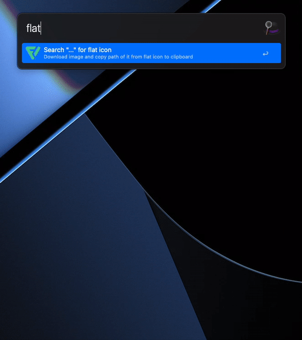

# 🌟 FlatIcon Alfred

Download image with Pack and Downloads count and copy path of it from flat icon to clipboard



## 🤔 How It's Work?

- Type `+` to end of the query to see more results.
- Search `query` on flaticon (for more specific settings, change shape or order_by in `main.py`)
- Creates `flaticon` folder to `HOME` directory and store every query it's own folder
- Download all image results if it's not exists
- When result selected, copy image path to clipboard

## 🪪  License

```
Copyright 2022 Yunus Emre Ak ~ YEmreAk.com

Licensed under the Apache License, Version 2.0 (the "License");
you may not use this file except in compliance with the License.
You may obtain a copy of the License at

    http://www.apache.org/licenses/LICENSE-2.0

Unless required by applicable law or agreed to in writing, software
distributed under the License is distributed on an "AS IS" BASIS,
WITHOUT WARRANTIES OR CONDITIONS OF ANY KIND, either express or implied.
See the License for the specific language governing permissions and
limitations under the License.
```
